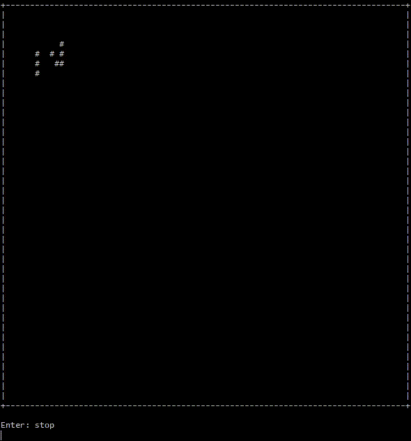

# Game of Life

For details on the rules, please see https://en.wikipedia.org/wiki/Conway%27s_Game_of_Life .

This was an exercise in a Test Driven Design workshop by Klaus Schmaranz.
I wanted to try it in rust. This is the result.

The main purpose was to train the TDD process:

- Write your test.
- Write just enough code to let your test compile and fail.
- Implement everything.
- Write more tests if there are bugs and fix them.
- Repeat for each implementation task until the application works.

## Experiences

Usually, I start by an example in `main` and use a top-down approach, repeatedly running the hard coded example.
Here, it was very natural to start with the rule set for cells.
The tests let me focus on completing my building blocks (functions, structs, modules, ...) before having to continue to the next higher abstraction level.
Even refactorings half-way, like moving the grid (`World`) out of the integration (`Life`) code, felt less scary. It was clear, that `Life` could wait until `World` was done.
After finishing the UT for `Life`, the last task was to implement a little example in `main`. It worked immediately, which is pretty exciting.

There are some topics I'm not sure about yet: I haven't done any mock-like thing. For proper modularity, I think, I should have used a simpler kernel function in the Life unit test and maybe replace the `World` with a simpler matrix implementation?
On the other hand, it seems a bit overkill to create a new World implementation just for testing, especiallay as it would require to introduce a trait for `World` and change the implementation of `Life`.

## Result

That's what it's currently doing when started in the console with `cargo run`.

